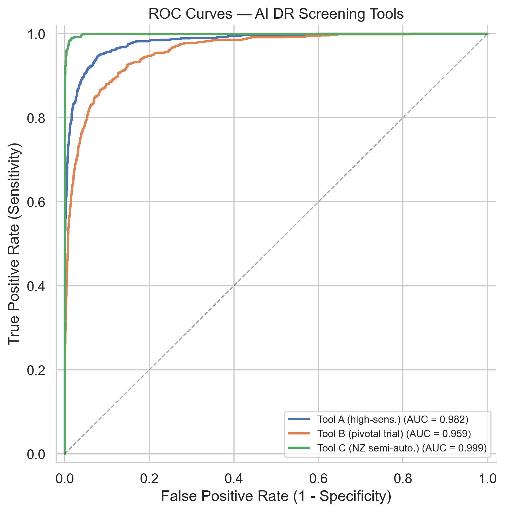
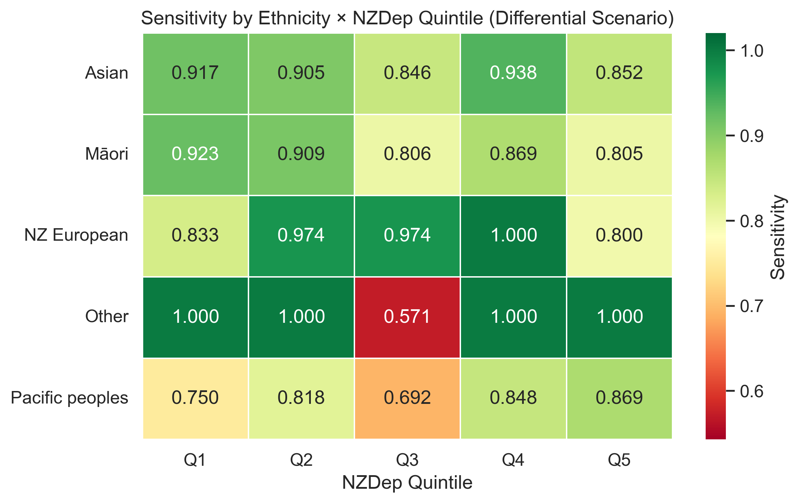
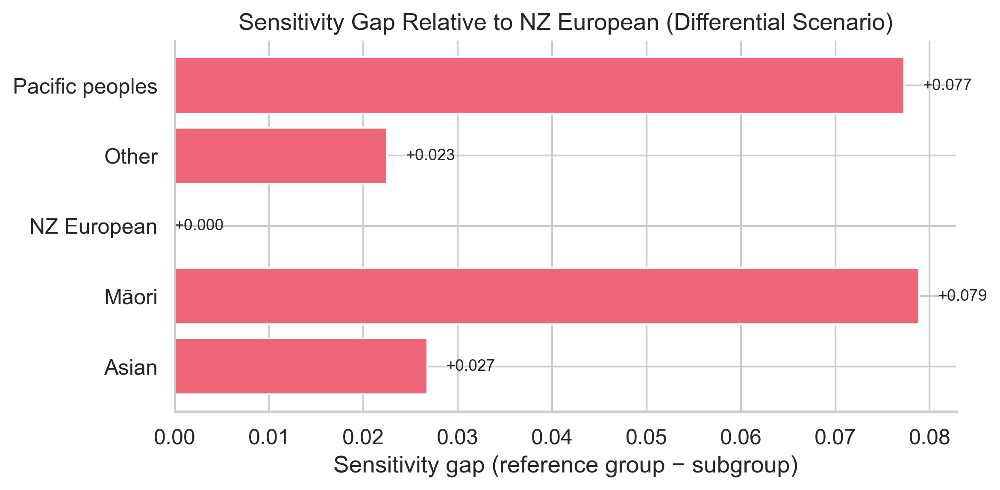

# Evaluating AI Diabetic Retinopathy Screening Tools: An Equity-Focused Framework for Aotearoa New Zealand

A simulation-based evaluation framework for assessing the diagnostic accuracy
and equity implications of AI-assisted diabetic retinopathy (DR) screening
across demographic subgroups in the Aotearoa New Zealand population. The
framework models three AI tool profiles — including
[THEIA](https://doi.org/10.1038/s41433-022-02217-w), a system developed and
validated within the NZ diabetic retinal screening programme — and evaluates
performance stratified by ethnicity and area deprivation (NZDep).

## Motivation

AI-assisted screening for diabetic retinopathy is increasingly being considered
for deployment within national health systems, including Aotearoa New Zealand's
diabetic retinal screening programme. While published clinical trials
demonstrate strong overall diagnostic accuracy, there is growing evidence that
AI tools can perform differently across demographic subgroups — raising concerns
about equity for populations that already experience disproportionate disease
burden.

Māori and Pacific peoples in New Zealand have higher rates of both diabetes and
diabetic retinopathy (Simmons et al., 2007), are more likely to live in areas
of high socioeconomic deprivation (Loring et al., 2022), and have lower
screening attendance (Ramke et al., 2019). If AI screening tools perform less
accurately for these populations, deployment could widen rather than narrow
existing health inequities.

This project develops and demonstrates an evaluation methodology that examines
AI tool performance through an equity lens, using published clinical trial data
and NZ population parameters.

## Approach

The framework uses a simulation-based design:

1. **Synthetic cohort generation** — 10,000 patients representing the NZ
   diabetic screening population, with demographics (ethnicity, age, sex, NZDep
   quintile) and true DR status drawn from published NZ data.

2. **AI prediction simulation** — Three AI tool profiles modelled on published
   clinical trial results (IDx-DR meta-analysis, IDx-DR pivotal trial, and the
   NZ-developed THEIA system), evaluated under equal-performance and
   differential-performance scenarios.

3. **Equity-stratified analysis** — Performance metrics disaggregated by
   ethnicity, area deprivation (NZDep), and their intersection, with
   statistical testing for significant differences.

All numerical parameters are sourced from published peer-reviewed literature
and documented in `config/parameters.yaml`.

## Project Structure

```
├── config/
│   └── parameters.yaml          # All simulation parameters with citations
├── notebooks/
│   ├── 01_cohort_simulation.ipynb       # Cohort generation and AI prediction simulation
│   ├── 02_performance_evaluation.ipynb  # Diagnostic accuracy, ROC, calibration
│   └── 03_equity_analysis.ipynb         # Subgroup analysis and equity assessment
├── src/
│   ├── cohort.py          # Cohort and prediction generation
│   ├── metrics.py         # Diagnostic accuracy and ROC utilities
│   ├── equity.py          # Stratified analysis and statistical testing
│   └── visualisation.py   # Plotting functions
├── data/                  # Generated data (not committed; see data/README.md)
├── outputs/
│   └── figures/           # Key output plots
├── requirements.txt
└── LICENSE
```

## Getting Started

```bash
python -m venv .venv
source .venv/bin/activate
pip install -r requirements.txt
```

Run the notebooks in order — Notebook 01 generates the data used by 02 and 03.

## Key Outputs

| Figure | Description |
|--------|-------------|
|  | ROC curves for three AI tool profiles |
|  | Sensitivity by ethnicity × NZDep quintile (differential scenario) |
|  | Sensitivity gap relative to NZ European |

## Key References

- Abramoff MD, Lavin PT, Birch M, et al. (2018). Pivotal trial of an autonomous
  AI-based diagnostic system for detection of diabetic retinopathy in primary
  care offices. *NPJ Digital Medicine*, 1:39.
- Khan Z, Gaidhane AM, et al. (2025). Diagnostic accuracy of IDX-DR for detecting
  diabetic retinopathy: a systematic review and meta-analysis. *American Journal
  of Ophthalmology*, 273:192-204.
- Vaghefi E, Yang S, Xie L, et al. (2023). A multi-centre prospective evaluation
  of THEIA to detect DR and DMO in the New Zealand screening program. *Eye*,
  37(8):1683-1689.
- Simmons D, Clover G, Hope C (2007). Ethnic differences in diabetic retinopathy.
  *Diabetic Medicine*, 24(10):1093-1098.
- Ramke J, Jordan V, Vincent AL, et al. (2019). Diabetic eye disease and screening
  attendance by ethnicity in New Zealand: a systematic review. *Clinical &
  Experimental Ophthalmology*, 47(7):937-947.
- Loring B, Paine SJ, Robson B, Reid P (2022). Analysis of deprivation distribution
  in New Zealand by ethnicity, 1991–2013. *NZ Medical Journal*, 135(1565):31-40.
- Seyyed-Kalantari L, Zhang H, McDermott MBA, et al. (2021). Underdiagnosis bias
  of artificial intelligence algorithms applied to chest radiographs in under-served
  patient populations. *Nature Medicine*, 27(12):2176-2182.
- Coyner AS, Singh P, Brown JM, et al. (2023). Association of biomarker-based AI
  with risk of racial bias in retinal images. *JAMA Ophthalmology*, 141(6):543-552.
- Yogarajan V, Dobbie G, Leitch S, et al. (2022). Data and model bias in AI for
  healthcare applications in New Zealand. *Frontiers in Computer Science*, 4:1070493.
- Health Quality & Safety Commission (2019). *A window on the quality of Aotearoa
  New Zealand's health care 2019 — a view on Māori health equity*. Wellington:
  HQSC. Available at: https://www.hqsc.govt.nz/resources/resource-library/a-window-on-the-quality-of-aotearoa-new-zealands-health-care-2019-a-view-on-maori-health-equity-2/
- Health Quality & Safety Commission. *Atlas of Healthcare Variation — Diabetes*.
  Available at: https://www.hqsc.govt.nz/our-data/atlas-of-healthcare-variation/diabetes/

## Limitations

This is a simulation study demonstrating an evaluation methodology and
plausible scenarios for AI screening performance across subgroups. The
differential-performance modifiers are illustrative, based on the direction and
pattern of bias documented in the literature, and should not be interpreted as
directly measured values for specific tools. DR prevalence estimates for some
ethnic groups rely on limited NZ data. Application of this framework to real
AI tool predictions on NZ screening data would provide more definitive findings.

## License

MIT
